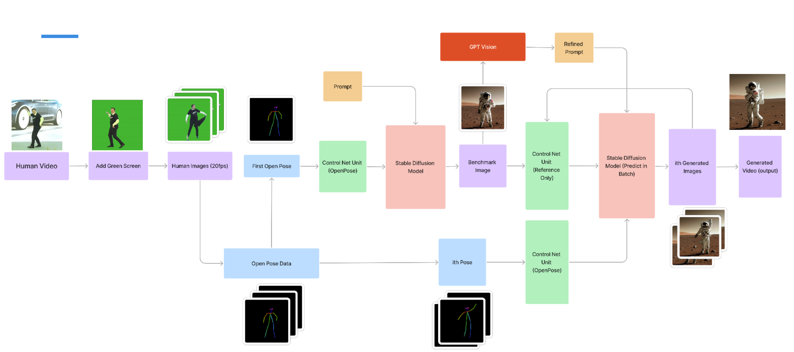

# Human Pose-Based Video Generation with Dual ControlNet-Enhanced Stable Diffusion

## Overview

This project introduces a novel video generation framework leveraging human pose estimation with generative diffusion models, particularly Stable Diffusion enhanced by a dual-layer ControlNet. The model achieves frame-to-frame consistency and accurately reproduces dynamic human poses from motion-captured video streams.

## Project Description

Our method utilizes ControlNet's capabilities to precisely control generated images based on human pose inputs (OpenPose) and maintains visual consistency through a reference-only control layer. The project involves building a specialized annotated dataset, training a pose-specific ControlNet, and generating coherent video sequences.

## Features

- **Dual-layer ControlNet**: Incorporates Pose ControlNet and Reference-Only Control for dynamic and stylistically consistent video frame generation.
- **OpenPose Integration**: Utilizes OpenPose for accurate human pose estimation.
- **Automated Dataset Creation**: Annotated dataset generation using OpenAI’s GPT-4 Vision API.
- **Customizable Control Mechanism**: Adjusts weights for pose and reference inputs to fine-tune generation consistency.

## Implementation Steps

1. **Dataset Creation**: Collected and annotated using OpenPose and OpenAI API, leveraging the Stanford 40 Actions dataset.
2. **Training**: Conducted ControlNet training, optimizing parameters and adjusting training datasets.
3. **Video Generation Pipeline**: Generated frame sequences guided by pose and reference inputs, compiled into cohesive videos.

## Results

- **Qualitative**: Demonstrated effective stylistic and pose consistency across generated video sequences.
- **Quantitative**: Identified parameter optimization strategies to improve the visual quality and frame-to-frame coherence.

## Contributions

- **David Wang**: Literature review, control mechanism optimization, dataset annotation, parameter tuning, ControlNet training.
- **Dijkstra Liu**: ControlNet testing, image annotation scripting, video generation pipeline development.
- **Joshua Tang**: Dataset research and compilation, OpenPose integration, foundational research.

## External Tools and Resources

- **OpenPose**: Real-time multi-person pose estimation.
- **OpenAI GPT-4 Vision API**: Automated image annotation for prompt generation.
- **Stable Diffusion**: Base generative model for image synthesis.
- **ControlNet**: Model to condition Stable Diffusion outputs based on external inputs.
- **Stable Diffusion-webui**: Interactive UI for image and video generation adjustments.

## Reference

Detailed methodological explanations, results, and additional information can be found in the full project report within this repository.

---

Developed by David Wang, Dijkstra Liu, and Joshua Tang.
